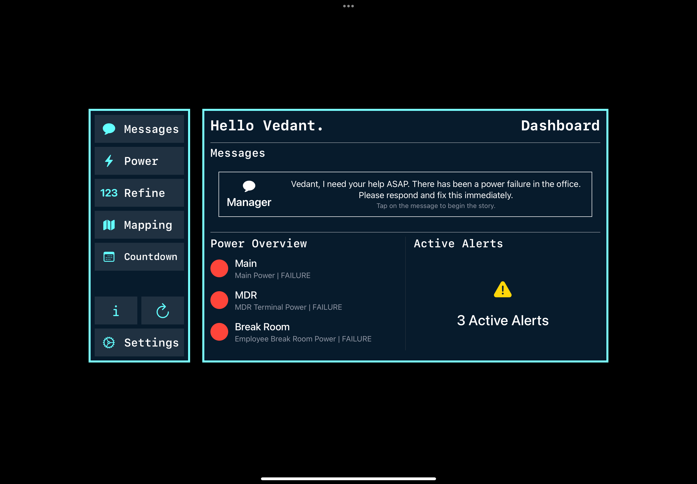
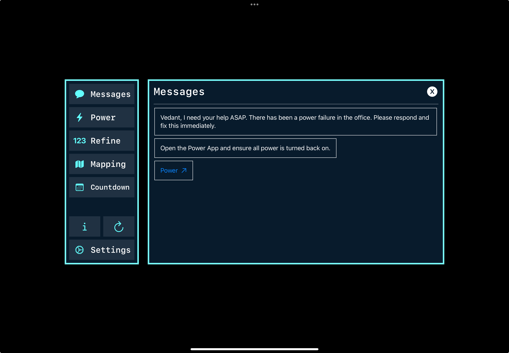
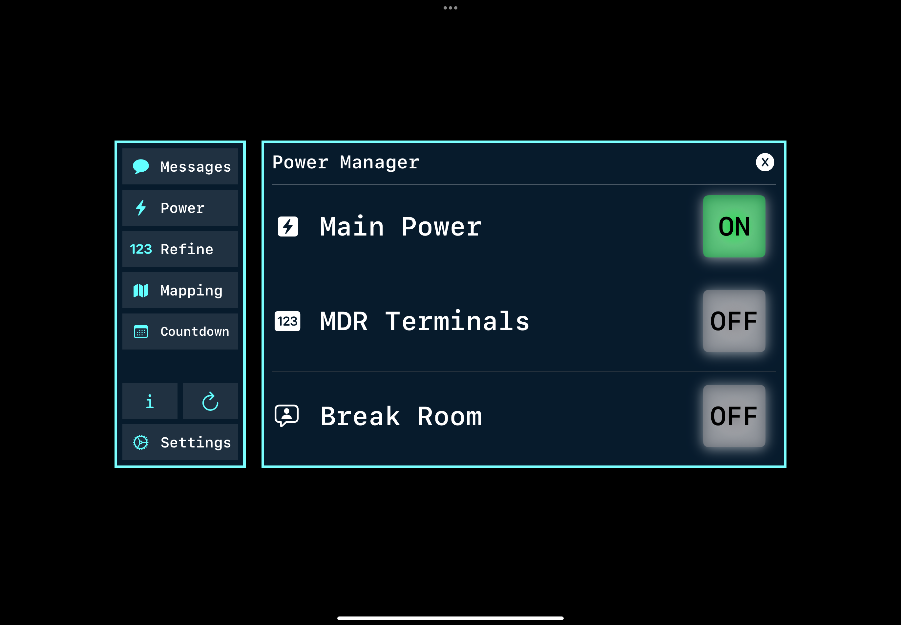
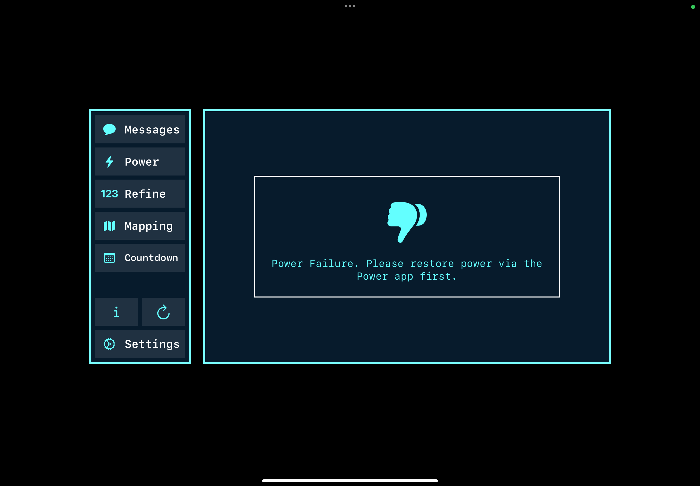
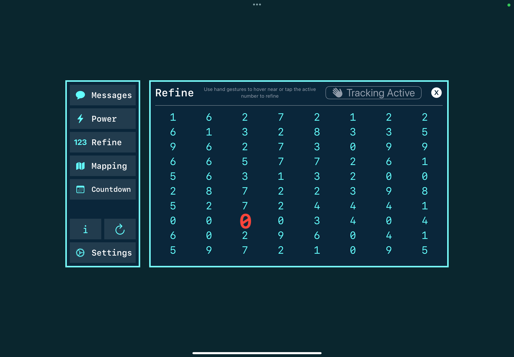

# LightsOn
My submission for the WWDC25 Swift Student Challenge!

## Status
[Not Accepted](https://x.com/vedantapps/status/1905304761492234594)

## Hand Tracking Demo (Refine)
[Hand Tracking Demo](https://youtu.be/_vfYAE1pfxY) 

## Full Project Demo
[Full Project Demo](https://youtu.be/RYuhLwb-i2U) 

## The Project
- Inspired by the Apple TV+ show [Severance](https://tv.apple.com/us/show/severance/umc.cmc.1srk2goyh2q2zdxcx605w8vtx)
- Interactive and immersive story puts the user as the Deputy Manager.
- A story that demonstrates how quick action, smart thinking, and teamwork can help resolve issues and drive solutions even in stressful/critical times.
- 7 total experiences (Messages, Power, Refine, Mapping, Countdown, Info, and Settings).
- Refine numbers with Hand Tracking. Simply hover your hand close to the number that needs to be refined.
- LightsOn is powered by SwiftUI, PencilKit (Apple Pencil Integration), and Vision (Hand Tracking).

## Screenshots

  
  
  
  
  

